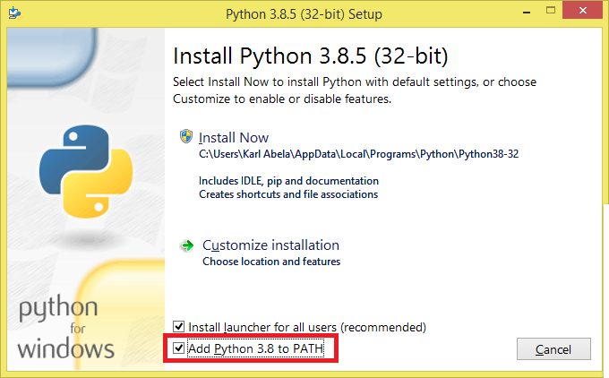

<!-- 
https://github.com/adam-p/markdown-here/wiki/Markdown-Cheatsheet
-->
# 00.Pre-requisites
This is part of a series that goes through all the steps needed to write a script that reads information from a website and save it locally. This section lists all the techologies you should be familiar with and all the tools that need to be installed.

## Basic knowledge of HTML
This article series assumes a basic understanding of web page source code including:
* Familiarity with Python 3.x
* HTML document structure
* Attributes of common HTML elements
* Basic JavaScript and AJAX
* CSS classes
* HTTP request parameters
* Awareness of lazy-loading techniques

A good place to start is [W3Schools](https://www.w3schools.com/html/html_intro.asp).

## Installing Python
As part of the pre-requisites, installing the correct version of Python and pip is required. This setup section assumes a Windows operating system, but it should be easily transferable to macOS or Linux.

Which Python version should one use: Python 2 or 3? This might have been a point of discussion in the past (Python 2.7 is the Latest version of Python 2.x and was released in 2010) since the two are not compatible, one had to pick a version. However today (2020) it is safe to go with version 3.x, with the latest stable version at the time of writing being 3.8.

Start by downloading the latest version of Python 3 from the [official website](https://www.python.org/downloads/windows/). Install it as you would with any other software. Make sure you add python to the PATH as shown below.



To confirm that it was successfully installed open the Command Prompt window and type __python__, you should see something like the following:
```
C:\WINDOWS\System32>python
Python 3.8.3 (tags/v3.8.3:6f8c832, May 13 2020, 22:20:19) [MSC v.1925 32 bit (Intel)] on win32
Type "help", "copyright", "credits" or "license" for more information.
>>> 
```
### Installing and using pip
pip is the package installer for Python. It is very likely that it came along with your Python installation. You can check by entering __pip -V__ in a Command Prompt Window, and you should see something like the following:
```
C:\WINDOWS\System32>pip -V
pip 20.1.1 from c:\path\to\python\python38-32\lib\site-packages\pip (python 3.8)
```
If pip is not available, it needs to be installed by following these steps:
* Download [get-pip.py](https://bootstrap.pypa.io/get-pip.py) to a folder on your computer.
* Open a command prompt
* Navigate to the folder where get-pip.py was saved
* Run the following command: __python get-pip.py__
