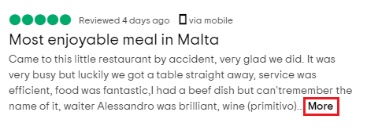

# 02.A Selenium scraper for TripAdvisor reviews

This article is part of a series that goes through all the steps needed to write a script that automatically scrapes information from a website. Other articles in this series so far covered:

*  [00.Pre-requisites](00.Pre-requisites.md)
*  [01.Introduction to Python scraping](01.PythonScraping.md)

This article is about scraping TripAdvisor reviews using Selenium. [TripAdvisor](tripdvisor.com) is a large travel platform with hundreds of millions of reviews on numerous things including restaurants. They provide [API](https://developer-tripadvisor.com/content-api/request-api-access/) to programmatically read data but it highly controlled and _"grants only a limited number of API keys, and does not allow access to the Content API for purposes of Data analysis, Academic research and Any use not associated with a consumer-facing (B2C) travel website or application"_.

This leaves us with scraping as the only option to download reviews programmatically. We are going to download the reviews of a particular restaurant, for the sake of this article we chose [Storie & Sapori - La Valletta](https://www.tripadvisor.com/Restaurant_Review-g190328-d8867662-Reviews-Storie_Sapori_La_Valletta-Valletta_Island_of_Malta.html). That said, approach and the code described should be applicable to all restaurants on TripAdvisor.

## Scraping challenges

### The More link

As highlighted in the screenshot below, TripAdvisor only loads part of the review initially and waits until the user clicks **More** to load the rest. 



When clicked some JavaScript is executed (code below), likely to make scraping harder. 

```html
<span class="taLnk ulBlueLinks" onclick="widgetEvCall('handlers.clickExpand',event,this);">More</span>
```

The net result is that using a scraping library like Beautiful Soup is not enough and we need to launch a browser and control is using Selenium to simulate pressing the **More** link and executing the JavaScript code.

### Graphical score
The score given by the reviewer is shown using an image made up of five circles, some of which are filled in green. The number of green circles indicate the score out of 5. There is no textual indication of the score, and this makes it hard to scrape. Upon closer inspection one can see that the CSS class of the SPAN element holds an indication of the score. Basically, if we split the class name using the '_' character, we can keep the substring at index 3 as the score. The examples below will result in scores of 40 and 10 respectively:

```html
<span class="ui_bubble_rating bubble_40"></span>
<span class="ui_bubble_rating bubble_10"></span>
```

## Finding the relevant HTML elements

Below is a cleaned HTML DIV element that holds one sample reviewed (Use F12 to turn on Developer Mode in your browser and inspect the code). The relevant parts are labelled with HTML comments.

```html
<div class="ui_column is-9">  <!-- CONTAINER -->
  <span class="ui_bubble_rating bubble_30"></span>  <!-- SCORE -->
  <span class="ratingDate" title="August 2, 2020">Reviewed 1 week ago </span>  <!-- DATE -->
  <div class="quote">
    <a href="/Show.....html" class="title " onclick="..JavaScript.." id="rn762691785">
	  <span class="noQuotes">Lunch</span>  <!-- TITLE -->
	</a>
  </div>
  <div class="prw_rup">
    <div class="entry">
	  <p class="partial_entry">
	    ..review here..  <!-- REVIEW -->
	    <span class="taLnk ulBlueLinks" onclick="..JavaScript..">More</span>  <!-- MORE Button -->
	  </p>
	</div>
  </div>
  ...
</div>
```

## Saving to CSV file
Once the data is gathered, it will be saved as a CSV file that can be analysed later. Python has built-in code for handling CSV data and the sample below shows how to use it:

```python
import csv
csvFile = open("file.csv", "w", newline='', encoding="utf-8")
csvWriter = csv.writer(csvFile)
csvWriter.writerow(('Heading1','Heading2'))
csvWriter.writerow(('row1col1', 'row1col2'))
csvWriter.writerow(('row2col1', 'row2col2'))
csvFile.close()
```


## Scraper script

A first version of the script that is as simple as possible to get the job done is found below:

```python
import csv
import time
from selenium import webdriver

URL = "https://www.tripadvisor.com/Restaurant_Review-g190328-d8867662-Reviews-Storie_Sapori_La_Valletta-Valletta_Island_of_Malta.html"

driver = webdriver.Chrome("./chromedriver")
driver.get(URL)

# Prepare CSV file
csvFile = open("reviews.csv", "w", newline='', encoding="utf-8")
csvWriter = csv.writer(csvFile)
csvWriter.writerow(['Score','Date','Title','Review'])

# Find and click the More link (to load all reviews)
driver.find_element_by_xpath("//span[@class='taLnk ulBlueLinks']").click()
time.sleep(5) # Wait for reviews to load

reviews = driver.find_elements_by_xpath("//div[@class='ui_column is-9']")
num_page_items = min(len(reviews), 10)

# Loop through the reviews found
for i in range(num_page_items):
	# get the score, date, title and review
    score_class = reviews[i].find_element_by_xpath(".//span[contains(@class, 'ui_bubble_rating bubble_')]").get_attribute("class")
    score = score_class.split("_")[3]
    date = reviews[i].find_element_by_xpath(".//span[@class='ratingDate']").get_attribute("title")
    title = reviews[i].find_element_by_xpath(".//span[@class='noQuotes']").text
    review = reviews[i].find_element_by_xpath(".//p[@class='partial_entry']").text.replace("\n", "")
    # Save to CSV
    csvWriter.writerow((score, date, title, review))

# Close CSV file and browser
csvFile.close()
driver.close()
```

## Sample output
Once the scraper runs successfully, it will produce a file named ```reviews.csv``` with the structure of the sample below:

```
Score,Date,Title,Review
50,"August 8, 2020",We love your pizzas!,"I went to this restaurant yesterday evening with some friends, ..."
50,"August 6, 2020",Most enjoyable meal in Malta,"Came to this little restaurant by accident, very glad we did..."
50,"March 6, 2020",#Osema,Good and reasonable food nice ambient highly recommended excellent service will visit again for sure
50,"March 6, 2020",#Osems,Excellent service with good food and very nice and kind staff will not be our last time here...
```

## Scraper limitations
It was decided to keep this part as simple as possible. The following limitations exist in the current version of the scraper and will be addressed in the next article in the series:

*  Only reviews in the first page are saved
*  A maximum of 10 reviews (or less) are saved
*  TripAdvisor filters out any non-English reviews by default
*  There is no exception handling whatsoever, resulting in a brittle script
*  The scraper will wait 5 seconds after clicking More, even if the reviews load in less time
*  General script maintainability and efficiency can be improved.
